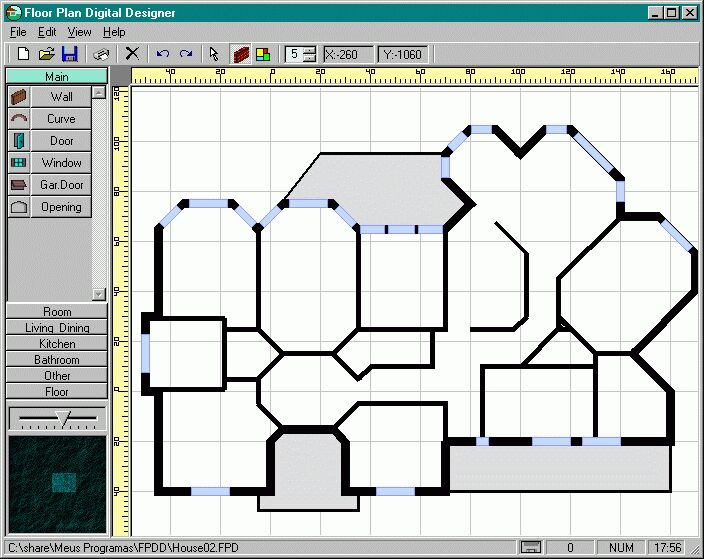



## Floorplan Designer

### Description

Design floorplans (Walls, windows and floors). Not finished. It was my first VB program (started in 1998). I was planning for more but never had time. Anyway I found ways to do it in another way so I am giving you the original ideia.
 
### More Info
 

             |
---                |---
**Submitted On**   |2001-01-11 02:04:06
**By**             |[Manuel Augusto Santos](https://github.com/Planet-Source-Code/PSCIndex/blob/master/ByAuthor/manuel-augusto-santos.md)
**Level**          |Advanced
**User Rating**    |4.9 (88 globes from 18 users)
**Compatibility**  |VB 6\.0
**Category**       |[Graphics](https://github.com/Planet-Source-Code/PSCIndex/blob/master/ByCategory/graphics__1-46.md)
**World**          |[Visual Basic](https://github.com/Planet-Source-Code/PSCIndex/blob/master/ByWorld/visual-basic.md)
**Archive File**   |[Floorplan\_162443852003\.zip](https://github.com/Planet-Source-Code/manuel-augusto-santos-floorplan-designer__1-47423/archive/master.zip)

